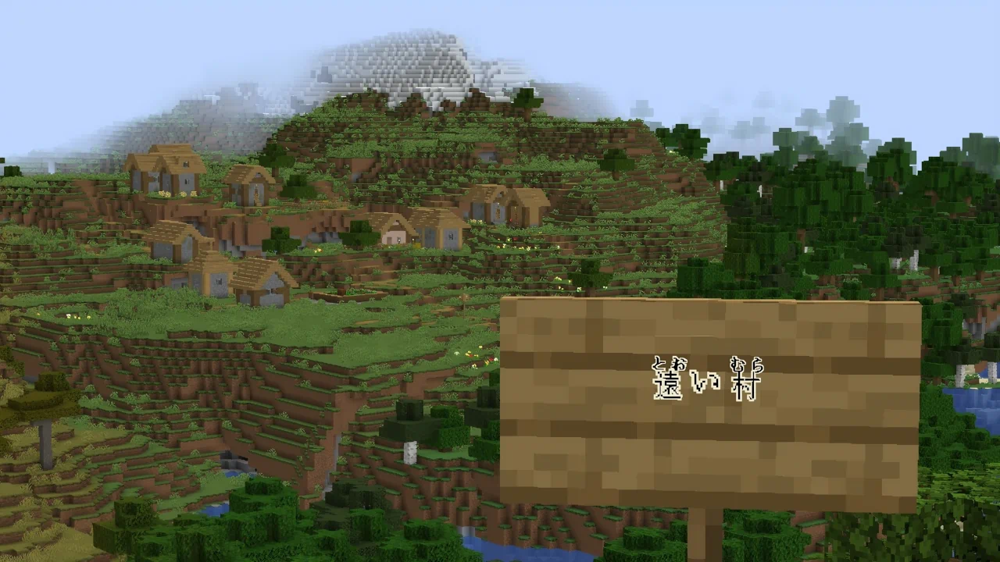
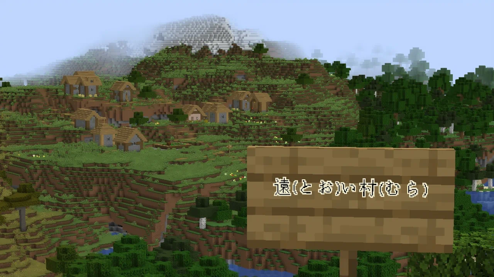
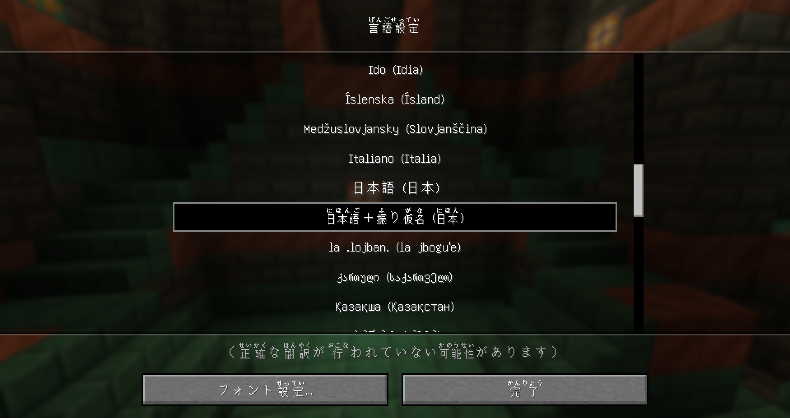
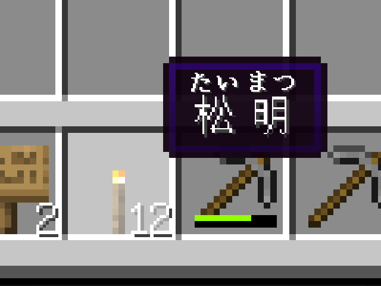
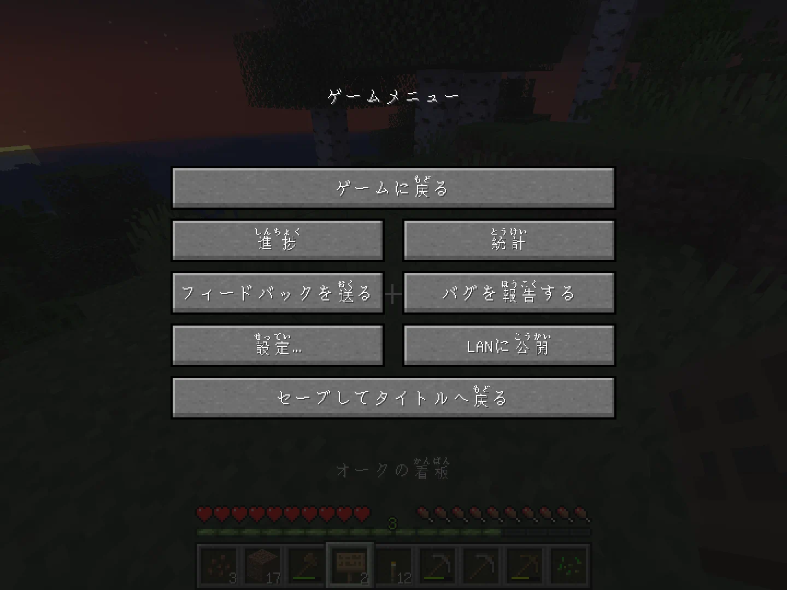
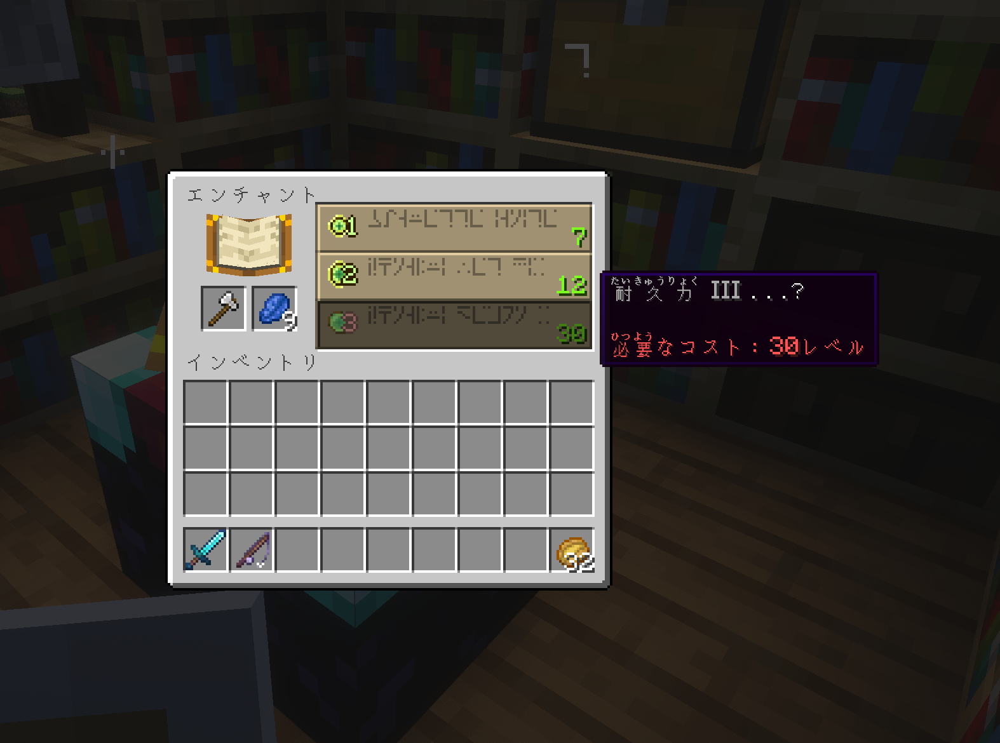

# Furigana

<div align="center">
    
    <caption>
        Furigana over Japanese text on a wooden sign in game <b>with the
        <a href="https://modrinth.com/mod/rubi">Rubi mod</a> enabled</b>.
    </caption>
</div>

## Introduction

A Minecraft resource pack that provides
[furigana](https://en.wikipedia.org/wiki/Furigana) for the Japanese language.

While the resource pack is fairly comprehensive, please note that I haven't
thoroughly verified every annotation (there are a lot of them), so I expect
there to be some inaccuracies. If you find any, please let me know by opening
an issue or submitting a pull request.

> [!TIP]
> You can use the **Rubi** mod to display the furigana above the text. This is
> not required, but highly recommended.

|  |  |
|:---:|:---:|
| Furigana + Rubi mod | Furigana only |

## Installation

* Download the latest release from
  [Modrinth](https://modrinth.com/resourcepack/furigana/versions)
* Assuming the download is in the default `Downloads` directory, you can use
  the following command to move the ZIP file to the `resourcepacks` directory:

  **Windows**:

  ```cmd
  move "%USERPROFILE%\Downloads\Furigana-v*+*.zip" "%APPDATA%\.minecraft\resourcepacks"
  ```

  **Linux**:

  The following command assumes you are using a Linux distribution that
  follows the
  [XDG Base Directory Specification](https://specifications.freedesktop.org/basedir-spec/latest/index.html)
  (most of the popular, widely-used distributions usually do).

  ```bash
  mv "$(xdg-user-dir DOWNLOAD)/Furigana-v*+1.2*.zip" "${HOME}/.minecraft/resourcepacks"
  ```

  **Manually**:

  Go to **Options** > **Resource Packs** and click the "Open Pack Folder"
  button, then move the downloaded ZIP into this directory.

* Within Minecraft, the resource pack adds a new language option that is
  separate from the standard Japanese translation. To enable it, go to
  **Options** > **Language** and select "日本語＋振り仮名 (日本)".

  

<h2 align="center">Showcase</h2>

<div align="center">
    
</div>

<div align="center">
    
</div>

<div align="center">
    
</div>
